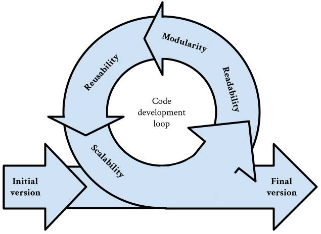

:::::::::::::::::::::::::::::::::::::: questions 

- Why should you know about code design?

::::::::::::::::::::::::::::::::::::::::::::::::

::::::::::::::::::::::::::::::::::::: objectives

- Understand the 4 main concepts developed in this course: Maintainability, readability, reusability and scalibility

::::::::::::::::::::::::::::::::::::::::::::::::

## Why should you care?

### A-  

### B- Designing your code is a continuous process

## Readability

## Reusability

## Maintainability

The maintainability of software depends on a few different factors. In general, it must be easy to understand the software (how it works, what it does, and why it does it the way it does), easy to find what needs to be change, easy to make changes and easy to check that the changes have not introduced any bugs.

Maintainable software allows you to quickly and easily:

- Fix a bug, without introducing a new bug as you do so
- Add new features, without introducing bugs as you do so
- Improve usability
- Increase performance
- Make a fix that prevents a bug from occurring in future
- Make changes to support new environments, operating systems or tools
- Bring new developers on board your project

It is defined by the 'IEEE Standard Glossary of Software Engineering Terminology' as ''
The ease with which a software system or component can be modified to correct faults, improve performance or other attributes, or adapt to a changed environment''

## Scalability

Scalability in software refers to the ability of a system, application, or process to handle increased loads or demands without compromising performance, reliability, or efficiency. This involves the capacity of the software to grow and manage higher demands by adding resources or optimizing the existing ones. Scalability is a critical consideration in software design and architecture, ensuring that the system can accommodate growth in users, transactions, data volume, or other metrics over time.

Multiple types of scalability can be considered, here are a few examples:

- Data scalability: The ability to efficiently store, retrieve, and process large volumes of data.
- User scalability: Supporting an increasing number of simultaneous users without degradation of performance
- Functional scalability: The ability to add new features of functionalities to the software without affecting existing performance

Benefits:
- Improved Performance: Scalable systems maintain or improve performance levels as the load increases.
- Cost Efficiency: Scalability allows for gradual investment in additional resources as needed, rather than over-provisioning from the start.
- Reliability and Availability: Scalable systems often include redundancy and failover mechanisms, improving overall system reliability and uptime.
- User Satisfaction: Providing consistent and reliable performance even as user demand grows ensures a better user experience.
- Future-Proofing: Designing for scalability ensures that the system can grow and adapt to future requirements without significant overhauls.

## Quizz

[r-markdown]: https://rmarkdown.rstudio.com/

Sources for this page:
[SSI maintainable software]: https://www.software.ac.uk/guide/developing-maintainable-software#:~:text=More%20formally%2C%20the%20IEEE%20Standard,adapt%20to%20a%20changed%20environment.%22
