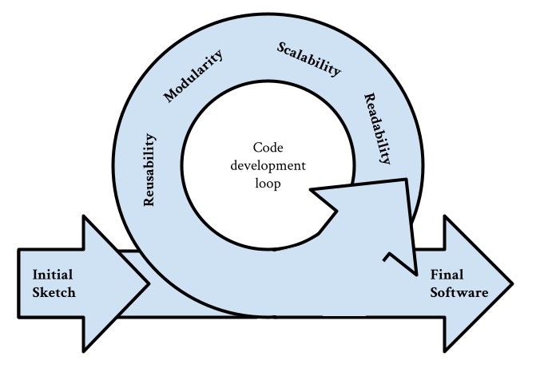

:::::::::::::::::::::::::::::::::::::: questions 

- Why should you know about code design?

::::::::::::::::::::::::::::::::::::::::::::::::

::::::::::::::::::::::::::::::::::::: objectives

- Understand the 4 main concepts developed in this course: Maintainability, readability, reusability and scalibility?

::::::::::::::::::::::::::::::::::::::::::::::::

## Introduction: the endless loop of code design

## Maintainability

## Readability

## Reusability

## Scalability

[r-markdown]: https://rmarkdown.rstudio.com/
